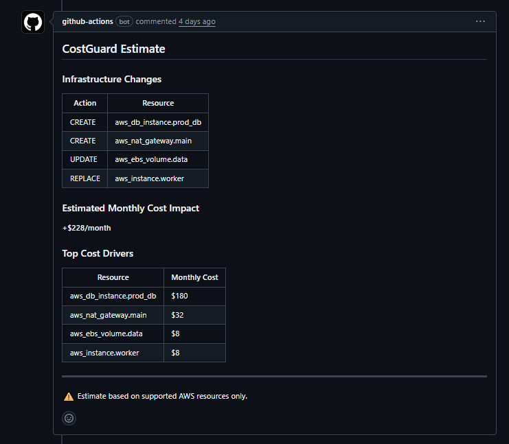

# CostGuard

**Prevent surprise cloud bills in Terraform pull requests.**



CostGuard analyzes Terraform infrastructure changes and comments the **estimated cloud cost impact directly on pull requests** before the changes are merged.

It integrates with CI/CD pipelines (via GitHub Actions) and helps engineering teams **detect expensive infrastructure decisions early during code review**.

---

## ✨ Features

- 💰 Cost estimation for Terraform changes
- 🔍 Pull request comments showing monthly cost impact
- ⚡ GitHub Action integration
- 🧪 Works with `terraform show -json`
- 🧰 Lightweight CLI tool
- 🧭 Clear visibility into top cost drivers
- 🐞 Optional debug mode

---

## Example Pull Request Comment

```
## 💰 CostGuard Estimate

Estimated Monthly Cost Impact: **+$228/month**

### Top Cost Drivers

| Resource | Monthly Cost |
|----------|--------------|
| aws_db_instance.prod_db | $180 |
| aws_nat_gateway.main | $32 |
| aws_ebs_volume.data | $8 |
| aws_instance.worker | $8 |

⚠️ Estimate based on supported AWS resources only.

Generated by CostGuard v1.0.0
```

---

## Quick Start

Add CostGuard to your repository using the GitHub Action.

```yaml
name: Terraform CostGuard

on:
  pull_request:

jobs:
  costguard:
    runs-on: ubuntu-latest

    permissions:
      contents: read
      pull-requests: write

    steps:
      - uses: actions/checkout@v4

      - uses: actions/setup-go@v5
        with:
          go-version: "1.22"

      - name: Terraform Plan
        run: |
          terraform init
          terraform plan -out plan.out
          terraform show -json plan.out > plan.json

      - name: Run CostGuard
        uses: captMcGoose/costguard@v1
        with:
          plan-file: plan.json
        env:
          GITHUB_TOKEN: ${{ secrets.GITHUB_TOKEN }}
```

---

## CLI Usage

### Analyze a Terraform plan

```bash
costguard analyze plan.json
```

Example output:

```
💰 CostGuard Estimate

Estimated Monthly Cost Impact: +$228/month

Top Cost Drivers
----------------
aws_db_instance.prod_db   $180
aws_nat_gateway.main      $32
aws_ebs_volume.data       $8
aws_instance.worker       $8
```

### Debug mode

```bash
costguard analyze --debug plan.json
```

### Version

```bash
costguard version
```

Example output:

```
CostGuard v1.0.0
```

---

## Supported Resources (MVP)

Current AWS resource coverage:

- aws_instance
- aws_db_instance
- aws_nat_gateway
- aws_ebs_volume

More resources will be added over time.

---

## How It Works

1. Terraform generates a plan

```
terraform plan -out plan.out
terraform show -json plan.out > plan.json
```

2. CostGuard parses the Terraform plan JSON.

3. CostGuard estimates monthly cost impact.

4. CostGuard posts a pull request comment with the results.

This allows engineers to **see the financial impact of infrastructure changes during code review**.

---

## Limitations

CostGuard is currently an MVP.

Known limitations:

- Limited AWS resource coverage
- Static pricing estimates
- Terraform plan JSON required
- AWS-only support for now

Future versions will expand coverage and capabilities.

---

## Roadmap

Planned improvements:

- Cost policies (`costguard.yaml`)
- Budget enforcement
- Infrastructure guardrails
- Slack alerts
- Cost history tracking
- Azure and GCP support

See:

```
docs/roadmap.md
```

---

## Contributing

Contributions are welcome.

To contribute:

1. Fork the repository
2. Create a feature branch
3. Submit a pull request

Bug reports and feature requests are encouraged.

---

## License

MIT License

---

## Vision

CostGuard aims to evolve into a **guardrail system for infrastructure changes**, helping teams prevent costly mistakes before infrastructure is deployed.
